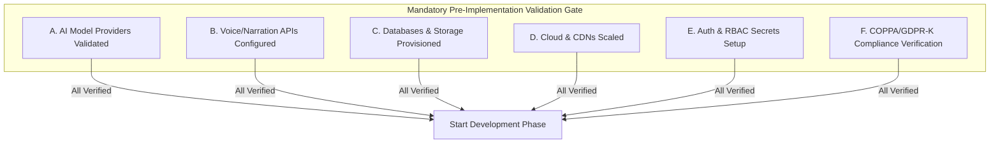
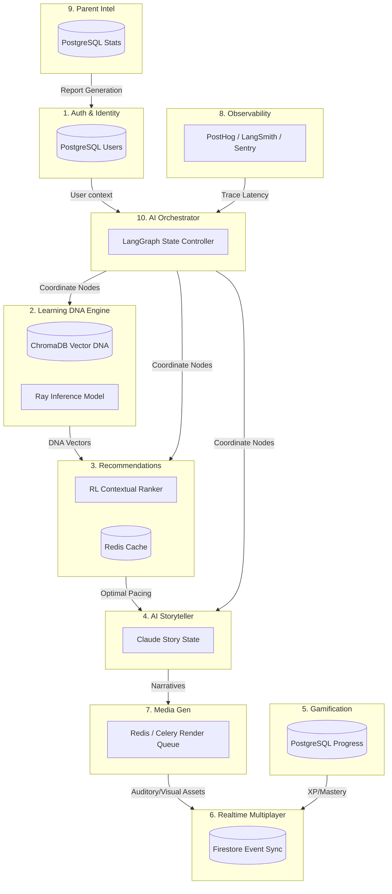
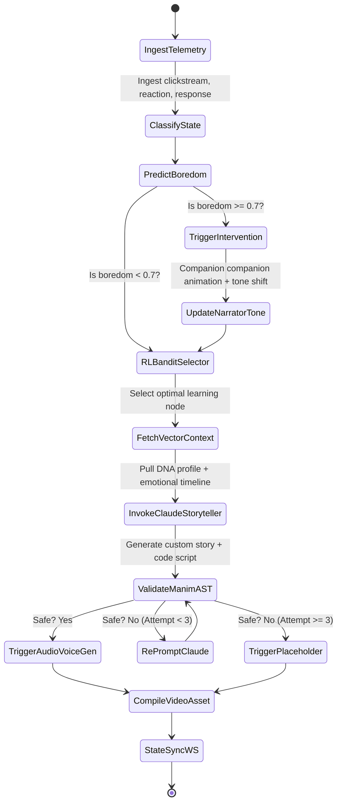

# Lerno.ai: Emotionally Adaptive AI Learning Operating System
### *"An emotionally adaptive AI learning operating system that evolves uniquely for every child."*

This document serves as the master production-grade engineering blueprint for the Lerno.ai platform. It details all system specifications, infrastructure requirements, database ownerships, compliance gates, and ML architectures. 

> [!CAUTION]
> **DEVELOPMENT GATE INSTRUCTION**
> No codebase implementation or feature development is permitted to proceed until all checkpoints in **Section 1: Pre-Implementation Requirements Validation** have been successfully verified and signed off by the lead system architect.

---

## SECTION 1 — PRE-IMPLEMENTATION REQUIREMENTS VALIDATION

Development cannot proceed until the following credentials, access tokens, API limits, and cloud configurations are validated and verified.



### A. AI Model Providers Checklist

| Provider / Resource | Required Metric / Permission | Assigned System Role |
| :--- | :--- | :--- |
| **Gemini 2.0 Flash / Pro** | API access key, >100 RPM limit, streaming enabled | Sentiment analysis, image/video asset classification, real-time visual scene generation |
| **Claude 3.7 Sonnet** | API access key, >50k tokens/min, streaming enabled | Onboarding intelligence, narrative world storytelling generation, recommendation reasoning |
| **OpenAI GPT-4o-mini** | API access key, optional fallback | Secondary translation, simple fallback parser |
| **Moderation API** | Content filtering active | Input screening (attacks/unsafe content check) |
| **Billing & Limits** | Verified credit card, auto-reload, alert threshold | Prevent API suspension during render scaling |

*   **Responsibility Matrix:**
    *   *Onboarding Intelligence:* **Claude 3.7 Sonnet** (for deep cognitive mapping and profiling).
    *   *Sentiment Analysis:* **Gemini 2.0 Flash** (for low-latency voice, text, and expression processing).
    *   *World Generation:* **Claude 3.7 Sonnet** (text-based world state and lore trees) & **Gemini 2.0 Pro** (custom world map/illustration assets).
    *   *Recommendation Reasoning:* **Claude 3.7 Sonnet** (semantic weight extraction).
    *   *Narration Scripting:* **Claude 3.7 Sonnet** (text scripts) -> **ElevenLabs** (audio generation).

---

### B. Voice & Narration Services Checklist

*   [ ] **ElevenLabs API Token:** Set up with custom voice cloning (or pre-defined parent-approved narrators). Latency profile must target `<250ms` time-to-first-byte (TTFB) for stream audio.
*   [ ] **Murf AI API Token:** Set up for fallbacks, multilingual translation narration support, and high-fidelity accents.
*   [ ] **Vapi API Token & Assistant ID:** Active configuration for real-time collaborative conversational child-assistant phone/voice sessions.
*   [ ] **Streaming Voice Capabilities:** WebSocket streaming audio endpoints verified for low-latency client-side WebAudio players.
*   [ ] **Narrator Safety Filter:** Strict content moderation parameters enabled at voice generation level to prevent generation of inappropriate auditory inflections or statements.

---

### C. Database & Storage Access Checklist

*   [ ] **Supabase / PostgreSQL Credentials:** Dedicated production cluster with `pgvector` extension enabled. SSL connections required.
*   [ ] **Firebase Firestore Configuration:** Real-time database rules locked down. Indexes created for active tracking.
*   [ ] **Firebase Storage Bucket:** Set up with cross-region replication for generated video/audio files. CDN (Cloudflare) caching routes configured.
*   [ ] **ChromaDB / Pinecone Instance:** Dedicated serverless vector cluster. Dimension settings matching model embeddings (`1536` for text-embedding-3).
*   [ ] **Redis Cache Instance:** Upstash or AWS ElastiCache credentials. Connection pool limits verified for high-frequency WebSocket sync.

---

### D. Deployment & Cloud Requirements Checklist

*   [ ] **Railway / GCP Infrastructure:** Production cluster configured with horizontal pod autoscalers (HPA) targeting CPU utilization >70%.
*   [ ] **Vercel Account:** Frontend domain mappings established with SSL certificates, edge redirects, and SSR caching rules.
*   [ ] **CDN Configurations:** Cloudflare CDN pointing to Firebase Storage with edge cache TTL set to 30 days for static assets.
*   [ ] **Environment Variables Mapping:** Validated across Staging (`lerno-stage`) and Production (`lerno-prod`) environments. No production secrets stored in git.

---

### E. Authentication & Security Checklist

*   [ ] **Firebase Auth/Clerk Integration:** Parent-approved login methods (Magic Link, Google Single Sign-On) active.
*   [ ] **JWT Secret Keys:** Rotated 256-bit HMAC keys active in environment.
*   [ ] **Parent-Child Relation RBAC:** Role definitions: `super_parent`, `child_user`, `ai_companion_agent`, `educator`.
*   [ ] **Protected Routes Mapping:** All `/api/` paths gated with token verification middleware.

---

### F. Compliance & Privacy Requirements Checklist

> [!CAUTION]
> **COMPLIANCE MANDATE**
> Lerno.ai operates under strict COPPA (Children's Online Privacy Protection Act) and GDPR-K regulations. Development must satisfy these criteria before beta testing:

1.  **Zero-PII Storage Policy:** All local storage, analytics, and metadata databases must anonymize child metrics. User IDs are UUIDs; names, emails, and phone numbers are exclusively stored under parent accounts in separate encrypted databases.
2.  **Parental Consent Verification (VPC):** Onboarding requires a credit card verification or email verification validation gate to verify parental permission before collecting telemetry.
3.  **Local Sentiment Inference:** Voice recordings or image/video frames used for sentiment estimation must be processed **client-side** where possible. Only the inferred sentiment vector floats (e.g., `[-0.2, 0.4]`) can be transmitted.
4.  **Automatic AI Filtering:** All outputs from Claude/Gemini must pass a local regex + semantic filter check (Moderation Pipeline) to ensure zero references to violence, mature themes, or direct political/religious positions.

---

## SECTION 2 — COMPLETE SYSTEM DEPARTMENTALIZATION

Lerno.ai is split into 10 architectural micro-departments, each operating within defined boundaries.



### 1. Authentication & Identity Department
*   **Responsibilities:** Parent registration, Child profile creation, Child-Parent account mapping, subscription verification, token issue.
*   **APIs Used:** Clerk / Firebase Auth.
*   **Databases Used:** PostgreSQL (relational tables: `parents`, `children`, `subscriptions`).
*   **Realtime Requirements:** None (standard HTTP REST).
*   **AI Dependencies:** None.
*   **Storage Requirements:** Negligible (JSON records).
*   **Scaling Considerations:** Session tokens cached in Redis for fast routing validation at the gateway.
*   **Security Considerations:** Password hashing via bcrypt, mandatory parent email verification, encrypted parent-child link tables.
*   **Telemetry Requirements:** Registration success rates, session duration.

### 2. Learning DNA & Cognitive Intelligence Department
*   **Responsibilities:** Real-time logging of user events, classification of curiosity type, sentiment extraction, frustration and boredom warning prediction.
*   **APIs Used:** Gemini (sentiment analysis API).
*   **Databases Used:** PostgreSQL (telemetry store), ChromaDB (behavioral embeddings).
*   **Realtime Requirements:** High (requires sub-100ms ingestion of clickstream telemetry).
*   **AI Dependencies:** Local ONNX models for attention classification, Gemini 2.0 Flash for multi-modal audio sentiment analysis.
*   **Storage Requirements:** High (large volumes of interaction event logs).
*   **Scaling Considerations:** Telemetry buffer queue (RabbitMQ) to handle spike write loads.
*   **Security Considerations:** Anonymized telemetry identifiers, encryption of database columns tracking cognitive profiles.
*   **Telemetry Requirements:** Hover duration, scroll speeds, mouse trajectory coordinates, click frequency, response lag times.

### 3. Recommendation & Personalization Department
*   **Responsibilities:** Context-aware content ranking, multi-armed bandit capability optimization, pacing adjustment, collaborative and graph recommendations.
*   **APIs Used:** None (local algorithms).
*   **Databases Used:** ChromaDB (profiles vector retrieval), Redis (cached recommendation ranks), PostgreSQL (aggregate scores).
*   **Realtime Requirements:** High (must recommend next card in `<100ms`).
*   **AI Dependencies:** Thompson Sampling (RL model), PyTorch ranking models.
*   **Storage Requirements:** Medium.
*   **Scaling Considerations:** Horizontal scaling of inference workers via Ray Serve.
*   **Security Considerations:** Filter lists preventing generation of restricted topics.
*   **Telemetry Requirements:** Recommendation click-through rate, retention curves.

### 4. AI Storytelling & World Generation Department
*   **Responsibilities:** Maintain universe lore trees, dynamically construct story arcs matching child's progression, manage companion dialogues, track dimension changes.
*   **APIs Used:** Claude 3.7 Sonnet.
*   **Databases Used:** ChromaDB (world history context vectors), PostgreSQL (dimensional state logs).
*   **Realtime Requirements:** Medium (generation in background during active nodes).
*   **AI Dependencies:** Claude (structured JSON storyteller).
*   **Storage Requirements:** S3 / Firebase Storage (persistent story text outputs).
*   **Scaling Considerations:** Async worker pool to prevent LLM blocking.
*   **Security Considerations:** Prompt guards shielding Claude from instruction injection.
*   **Telemetry Requirements:** Story node completion rates, dialogue feedback metrics.

### 5. Gamification & Progression Department
*   **Responsibilities:** Update XP totals, handle skill tree locks/unlocks, synchronize companion relationship levels, award achievements.
*   **APIs Used:** None.
*   **Databases Used:** PostgreSQL (relations: `user_skills`, `unlocks`, `achievements`), Redis (leaderboard caching).
*   **Realtime Requirements:** Real-time leaderboard updates (under 500ms latency).
*   **AI Dependencies:** None.
*   **Storage Requirements:** Low.
*   **Scaling Considerations:** Redis sorted sets for instantaneous global and class leaderboards.
*   **Security Considerations:** Validation checks on client-side requests to prevent fraudulent XP submissions.
*   **Telemetry Requirements:** Streak frequency, unlock distributions.

### 6. Realtime Multiplayer & Social Department
*   **Responsibilities:** Sync collaborative group questions, coordinate co-op boss battles, support guilds, display active presence.
*   **APIs Used:** None.
*   **Realtime Infrastructure:** Firebase Firestore (websockets & listeners), Redis Pub/Sub.
*   **Databases Used:** Firestore, Redis.
*   **AI Dependencies:** Gemini (live chat moderation to filter child chat rooms).
*   **Storage Requirements:** Low.
*   **Scaling Considerations:** Horizontal sharding of socket connection brokers.
*   **Security Considerations:** Complete omission of real-name chat; communication limited to pre-defined expressions, emoji, and heavily filtered texts.
*   **Telemetry Requirements:** Active co-op sessions, message filter trigger rates.

### 7. AI Media Generation Department
*   **Responsibilities:** Render custom illustrations, compile narration audio, orchestrate prefetching queues, output animation videos.
*   **APIs Used:** Gemini (image), ElevenLabs / Murf (narration voice).
*   **Databases Used:** Redis (rendering queue).
*   **Storage Requirements:** High (S3 storage for all generated `.mp4` and `.mp3` assets).
*   **AI Dependencies:** Imagen-3, ElevenLabs.
*   **Queue Systems:** Redis / Celery.
*   **Scaling Considerations:** GPU rendering nodes dynamically scale on AWS/GCP to process Manim scripts.
*   **Security Considerations:** Signed URLs for all media links; expiration set to 2 hours.
*   **Telemetry Requirements:** Asset rendering latency, compilation success rates.

### 8. Analytics & Observability Department
*   **Responsibilities:** Track model latency, profile system bottlenecks, compile error trace logs, run A/B test splits.
*   **APIs Used:** PostHog, LangSmith, Sentry, OpenTelemetry.
*   **Databases Used:** None (SaaS dashboards).
*   **Realtime Requirements:** Low (async telemetry export).
*   **AI Dependencies:** None.
*   **Storage Requirements:** None.
*   **Scaling Considerations:** Batch export agents to minimize load on application servers.
*   **Security Considerations:** Omission of database records, emails, or child profiles from tracing exports.
*   **Telemetry Requirements:** System latency, API call costs, error frequencies.

### 9. Parent Intelligence Department
*   **Responsibilities:** Generate parent-centric child dashboard statistics, predict academic burnout indicators, compile consistency ratings, output Weekly PDF reports.
*   **APIs Used:** Claude (to format conversational parent insights).
*   **Databases Used:** PostgreSQL (analytics schema).
*   **Realtime Requirements:** Low.
*   **AI Dependencies:** Claude.
*   **Storage Requirements:** S3 (Weekly PDF reports storage).
*   **Scaling Considerations:** Background worker cron-job system to compile statistics outside peak hours.
*   **Security Considerations:** Isolation of parent panel; parents cannot write or access active live child session states.
*   **Telemetry Requirements:** Dashboard visit frequency, email open rates.

### 10. Orchestrator & AI Pipeline Department
*   **Responsibilities:** Direct the LangGraph loop, maintain session memory contexts, manage fallback routes, execute recovery tasks.
*   **APIs Used:** None.
*   **Databases Used:** Redis (active nodes state storage).
*   **AI Dependencies:** LangGraph.
*   **Queue Systems:** Redis queues / Celery.
*   **Scaling Considerations:** State caching in Redis allows stateless scaling of NestJS orchestrators.
*   **Security Considerations:** Execution limits on graph iterations to prevent infinite recursive LLM API loops.
*   **Telemetry Requirements:** Graph cycle duration, loop retry frequencies.

---

## SECTION 3 — DATABASE RESPONSIBILITY MATRIX

The data storage system is strictly compartmentalized to prevent overlap and ensure optimal query performance.

| Database System | Primary Responsibility | Data Entities Stored | Vector Capability | Latency Target |
| :--- | :--- | :--- | :--- | :--- |
| **PostgreSQL** | Relational data, billing, permanent progress logs | `parents`, `children`, `skills_unlocked`, `xp_logs`, `achievements`, `billing` | Yes (via `pgvector`) | Read: `<10ms`, Write: `<20ms` |
| **ChromaDB** | AI memory, semantic profiles, narrative historical data | `cognitive_dna_embeddings`, `historical_success_vectors`, `companion_memory_embeddings` | Yes (Native Vector DB) | Query: `<35ms` |
| **Firebase Firestore** | Realtime client-server state sync, live multiplayer co-op sessions | `websocket_connections`, `live_coop_lobbies`, `companion_active_state` | No | Sync: `<150ms` |
| **Redis** | High-speed cache, API rate limits, message queues | `active_sessions`, `recommendation_ranking_cache`, `celery_task_broker` | No | Read/Write: `<2ms` |
| **AWS S3 / Firebase Storage** | Binary large objects (Media Assets) | `.mp4` (videos), `.png` (world maps), `.mp3` (audio narrations) | No | TTFB: `<150ms` (via CDN) |

---

## SECTION 4 — SCALABILITY & INFRASTRUCTURE STRATEGY

### Infrastructure Evolution Roadmap

```mermaid
chronology
    title Lerno.ai Infrastructure Evolution Phases
    2026-06 : MVP : Single container API, SQLite vector prototyping, Local Redis, Firebase free tier
    2026-08 : Beta Scaling : Horizontal API pods on Kubernetes, Managed pgvector cluster, Cloudflare CDN
    2026-10 : Public Launch : Multi-region WebSocket gateways, Ray Serve cluster for ML, RabbitMQ broker
    2026-12 : Global Scaling : Edge database replication (Supabase Global), Dedicated GPU cluster for Manim, Multi-region S3 replication
```

### Advanced Infrastructure Optimizations

1.  **Microservice Communication Protocol:**
    *   *Synchronous Communication:* Internal JSON-RPC over HTTP/2 (gRPC) for low-latency calls between gateways and recommendation modules.
    *   *Asynchronous Communication:* Event-driven model via RabbitMQ for telemetry logging, PDF generation, and Manim rendering commands.
2.  **ML Inference Auto-Scaling:**
    *   Deploy ML models (Boredom XGBoost, Bandit Thompson Sampling) via **Ray Serve** running on Spot GPU instances. Automatic scaling triggers when the inference request queue length exceeds 50 tasks per node.
3.  **Vector Search Performance Optimization:**
    *   Index optimization in pgvector/ChromaDB using **HNSW (Hierarchical Navigable Small World)** graphs with Cosine distance metric.
    *   Periodic vector compression (Product Quantization) to fit the entire active vector working set within RAM, targeting query times of `<20ms`.
4.  **Edge Caching & Latency Shielding:**
    *   Use Cloudflare Edge Workers to analyze the geographical region of incoming user requests and serve cached narration voice files (`.mp3`) from the closest local edge bucket.

---

## SECTION 5 — AI ORCHESTRATION & PIPELINES

### LangGraph State Transition Architecture



### Sync vs Async Execution & Recovery Pipeline

*   **Synchronous Operations (Blocking Gateway):**
    *   Pydantic schema validation.
    *   Redis active cache check.
    *   JWT auth verify.
    *   *If failed:* Immediate return of REST/WS error code (e.g. `400` / `401`).
*   **Asynchronous Operations (Non-Blocking Workers):**
    *   Manim script rendering.
    *   ElevenLabs text-to-speech creation.
    *   ChromaDB vector embedding updates.
    *   Parent reports generation.
*   **Queue Priority Levels:**
    *   `High` (Priority 1): Dynamic storyboard generation & voice compile for the **next active node**.
    *   `Medium` (Priority 2): Telemetry aggregation writes, social interaction syncs.
    *   `Low` (Priority 3): Parent dashboard metrics compilation, weekly summaries, old vector index rebalancing.
*   **Failure Recovery Rules (Self-Healing Loop):**
    *   *Claude AST check fails:* Automatic loop re-prompts Claude with exact compiler errors (up to 3 retries).
    *   *Voice compilation fails:* Swaps from high-latency ElevenLabs API to local fallback TTS library or Murf API.
    *   *Manim compilation fails (3 retries exhausted):* Inserts a fallback illustration card using `PLACEHOLDER_VIDEO_URL` and records a telemetry event to prevent subsequent generations from using the offending code structure.

---

## SECTION 6 — MASTER CHECKLISTS & ECOSYSTEM DIAGRAMS

### Ecosystem API Dependency Map
*   **Auth Gate:** Clerk / Firebase Auth.
*   **Story Generation Engine:** Anthropic API (Claude-3.7-Sonnet).
*   **Classification & Sentiment Core:** Google Gemini API (Gemini-2.0-Flash).
*   **Narration Pipeline:** ElevenLabs API (Primary) / Murf API (Secondary).
*   **Interactive Voice Gateway:** Vapi API.
*   **Realtime Client Sync:** Firebase Firestore SDK.
*   **Observability Hub:** LangSmith (LLM performance tracking) / PostHog (UX events).

### Production Security Checklist

- [ ] **Data Encryption:** All data in transit must use TLS 1.3. Databases encrypted at rest using AES-256.
- [ ] **Token Expiration:** JWT session tokens expire in 15 minutes, with secure HTTP-only refresh tokens.
- [ ] **Rate Limiting:** IP-based and user-based limits active at gateway (e.g., max 60 calls/min).
- [ ] **API Payload Size Limits:** Restrict inbound JSON size to maximum `100KB` on all endpoints.
- [ ] **SQL Injection Defense:** All queries to PostgreSQL must use parameter binding (ORM layer).
- [ ] **LLM Jailbreak Protections:** System prompts contain isolated system instructions; user inputs are wrapped inside structural XML tags to prevent prompt injection.

### Production Compliance Checklist

- [ ] **COPPA Gate Active:** Block registration for accounts under 13 without verified parental consent.
- [ ] **PII Scrubbing Middleware:** Log files, error traces, and vector storage scrubbed of emails, usernames, or physical locations.
- [ ] **Parent Control Center:** Parent account must have the ability to view, download, and delete all child telemetry history with one click.
- [ ] **Voice Consent:** Parents must explicitly opt-in to child voice recording interactions for Vapi.
- [ ] **Child-Safe Content Filtering:** Semantic check gates verify all model outputs against age-appropriate parameters before rendering.
